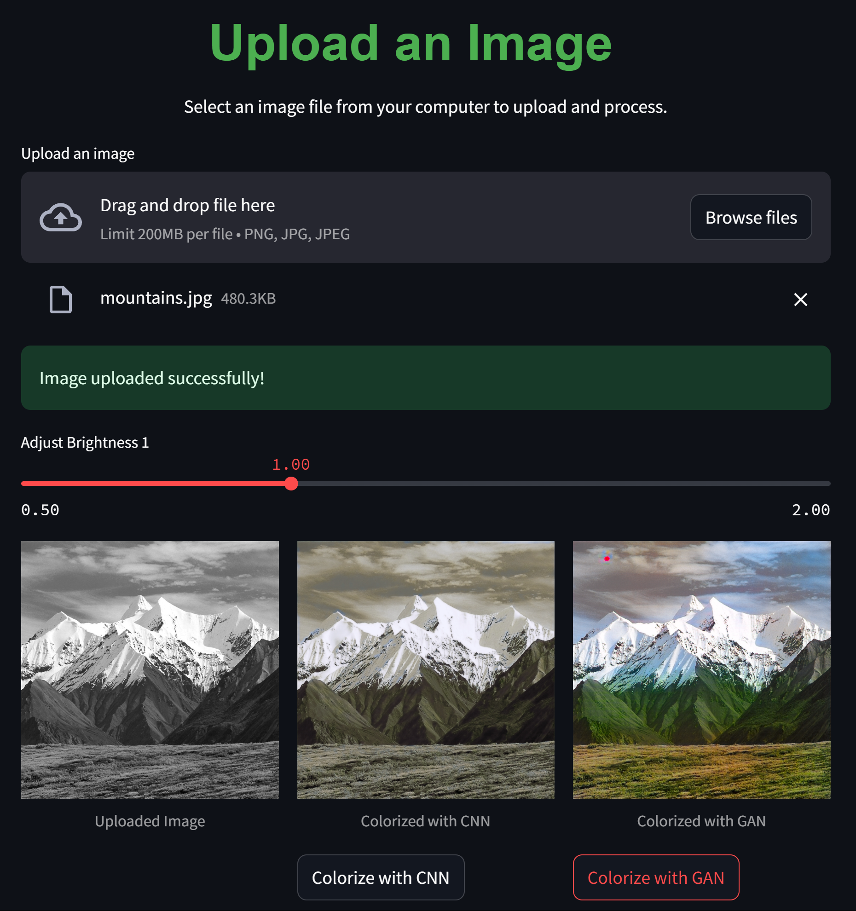
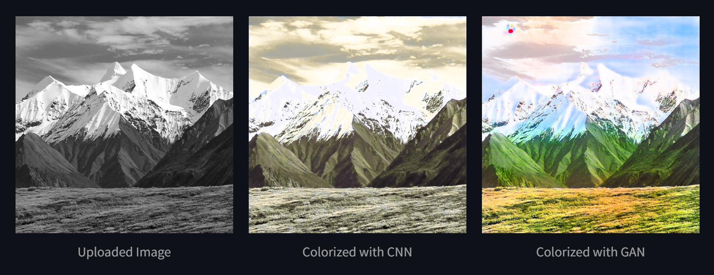
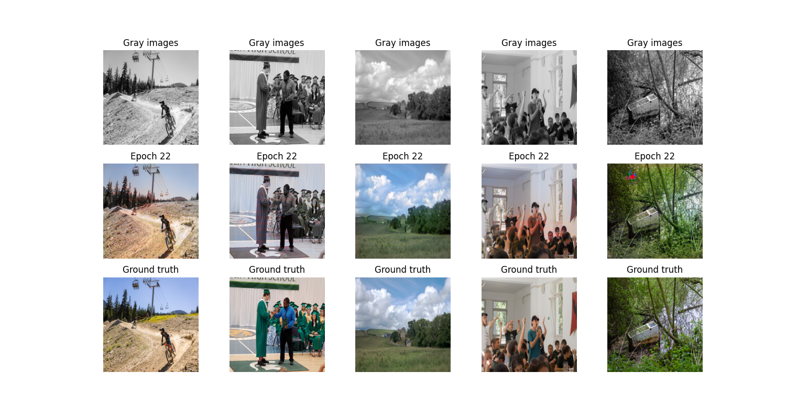

# Black & White Photo Colorization and Restoration

## Team Members
- **Chulpan Valiullina**
- **Anastasia Pichugina**
- **Saveliy Khlebnov**

## Project Overview
We build two models CNN and GAN for colorizing black and white images.

# Project Directory Structure

```plaintext
project_root/
├── .vscode/              # IDE settings
├── config/               # Configuration files      
├── model/                # Source
│   ├── data/             # Functions for dataset preprocessing and evaluation
│   └── training/         # Scripts for training different model types
├── models/               # Model weights
│   ├── cnn/              # Best CNN weights 
│   └── gan/              # Best GAN weights 
├── plots/                # Training result visualizations
│   ├── cnn/              # CNN result images
│   └── gan/              # GAN result images
├── results/              # Website screenshots and results of colorization
├── scripts/              # .py script for the dataset generation and loading
├── templates/            # Files for the web interface
├── uploads/              # Images for testing
├── GAN_demo.ipynb        # GAN demo
├── CNN_demo.ipynb        # CNN demo
├── main.py               # Streamlit app
├── test.py               # Test image generation and save it to results/
├── README.md             
├── requirements.txt
└── .gitattributes
```

## Webpage
Results of colorization on our webpage:

Higher brightness


## Current Progress
- We achieved notable results using a GAN-based approach, with the best model from epoch 22:


## GAN model access
We couldn't upload it to github due to file size limitations, so you can download our best gan model `best.pth` from [Google drive](https://drive.google.com/file/d/19awWsef7oDQxMFGN7_qN2Cd0pQE1E6Jl/view?usp=drive_link) for your use.

## Dataset
We are utilizing the [Public Flickr Photos License 1 Dataset](https://huggingface.co/datasets/Chr0my/public_flickr_photos_license_1), containing **120 million colorful images**. These images are preprocessed into grayscale for training.

## Work Distribution
- **Saveliy**: Model development and experimentation.
- **Chulpan**: Model evaluation, backend/frontend development.
- **Anastasia**: Model training, evaluation, and documentation.

## License
The project is developed using Hugging Face's [license](https://spdx.org/licenses/CC-BY-NC-SA-3.0).

## Getting Started

Our project is already able to be run on your local machine.

Clone the repository and run ``pip install -r requirements.txt`` to start working.

### Web application

To run the web page on your local machine:
- Run the main.py from the root directory. GAN weights will be downloaded on the fly if you don't have it and CNN weights are in the models/cnn/ folder.

> If you want the GAN model's weights, you can find them [here](https://drive.google.com/drive/folders/1xPMJcXidp2cRWRJ7m4eSJJ-9eYRgQTfp?usp=drive_link). Using them, you could train the models more and get better results. 

### Model training from scratch

If you would like to retrain models or adjust them and get a new one:
- Fix the config/vars_config.json file: number of epochs, batch size, image resolution (pic_size), amount of pictures in your dataset, model type, and train_validation split;
- Run the model/train.py. Plots and models will be downloaded to the plots/model_type/ and models/model_type/ folders;
- **Kaggle** or **Google Colab** training. Refer to the [CNN_demo.ipynb](https://drive.google.com/file/d/1Fy1CdoJpW4A7p5jYlU7xdH8mqWX3ehU_/view?usp=drive_link) to see an example of train run on Kaggle. Refer to the [GAN_demo.ipynb](https://drive.google.com/file/d/1mPiweErrcQatwCdQrbDMiHiwYqcatWOH/view?usp=drive_link) to see an example of train run on Google Colab.

### Dataset creation  for model training

If you want to apply your own dataset:
- Adjust variables in config/vars_config.json file (total images number, train_test split, and pic_size - resolution to which images will be resized);
- Change the source from which images will be downloaded (model/data/functions.py get_urls() method);
- Run the scripts/generate_datset.py. Pictures will be downloaded to the pictures/ folder: train part in the pictures/train/ and validation part in the pictures/val/.
