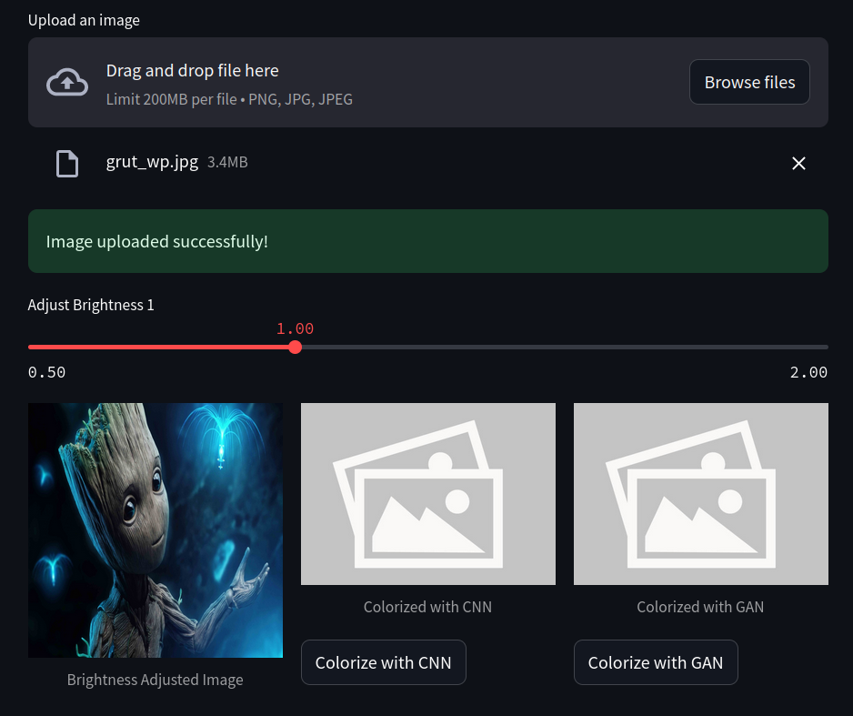

# Black & White Photo Colorization and Restoration

## Team Members
- **Chulpan Valiullina**
- **Anastasia Pichugina**
- **Saveliy Khlebnov**

## Project Overview
This project focuses on building a robust model for colorizing black and white photos.

# Project Directory Structure

```plaintext
project_root/
├── .vscode/              # IDE-specific settings
├── config/               # Configuration files
├── model/                # Model training
│   ├── data/             # Functions for dataset preprocessing and evaluation
│   └── training/         # Scripts for training different model types
├── models/               # Best model weights
│   ├── cnn/              # Best CNN weights 
│   └── gan/              # Best GAN weights 
├── plots/                # Training result visualizations
│   ├── cnn/              # CNN result images
│   └── gan/              # GAN result images
├── results/              # Website screenshots and results of colorization
├── scripts/              # .py script for the dataset generation and loading
├── templates/            # Files for the web interface
├── uploads/              # Images for testing
├── GAN_demo.ipynb        # GAN demo
├── CNN_demo.ipynb        # CNN demo
├── main.py               # Streamlit app
├── test.py               # Test image generation and save to results/
├── README.md             
├── requirements.txt
└── .gitattributes
```


## Current Progress
- We achieved notable results using a GAN-based approach, with the best model from epoch 22:


## Webpage
Our web page:


Results of colorization:


## Dataset
We are utilizing the [Public Flickr Photos License 1 Dataset](https://huggingface.co/datasets/Chr0my/public_flickr_photos_license_1), containing **120 million colorful images**. These images are preprocessed into grayscale for training.

## Work Distribution
- **Saveliy**: Model development and experimentation.
- **Chulpan**: Model evaluation, backend/frontend development.
- **Anastasia**: Model training, evaluation, and documentation.

## License
The project is developed using Hugging Face's [license](https://spdx.org/licenses/CC-BY-NC-SA-3.0).
